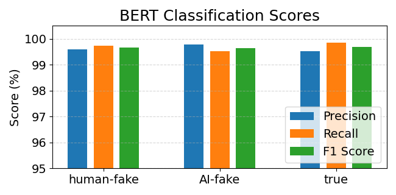

# News Classification System

A comprehensive news classification system that can classify news articles into three categories: true, fake, and AI-generated content.

## Overview

This project implements a sophisticated news classification system that:
- Loads and preprocesses news data from multiple sources
- Performs data analysis and visualization
- Applies different sampling techniques for class balance
- Extracts features using TF-IDF or Sentence Transformers
- Trains and evaluates multiple classification models

## Features

- **Data Processing**
  - Text cleaning and normalization
  - HTML character replacement
  - Prefix removal
  - Duplicate detection

- **Feature Extraction**
  - TF-IDF vectorization
  - Sentence Transformer embeddings
  - Dimensionality reduction (PCA)

- **Classification Models**
  - Logistic Regression
  - Support Vector Machine (SVM)
  - Random Forest

- **Data Analysis**
  - Text length distribution analysis
  - KMeans clustering
  - PCA visualization
  - Confusion matrix analysis

## Requirements

- Python 3.7+
- Dependencies listed in `requirements.txt`:
  - pandas>=1.3.0
  - numpy>=1.21.0
  - matplotlib>=3.4.0
  - seaborn>=0.11.0
  - scikit-learn>=1.0.0
  - sentence-transformers>=2.2.0
  - transformers>=4.5.0
  - datasets>=1.11.0
  - evaluate==0.4.3
  - torch>=1.9.0
## Installation

1. Clone the repository:
```bash
git clone [repository-url]
cd [repository-name]
```

2. Install dependencies:
```bash
pip install -r requirements.txt
```

## Usage

The project consists of two main Python scripts:

1. `news_classifier.py`: The clearer implementation with a command-line interface (results maybe different than these in Google Colab due to package version difference, random seed, and batching)
2. `fake_real_news.py`: Google Colab implementation with detailed analysis (we use the results from here for the report and poster)
3. `distilBERT.py`: The DistilBERT model implementation for our new benchmark can be run on Google Colab or submitted to GreatLakes via a SLURM script.
### Running the Classifier

```bash
python news_classifier.py --sampling [none|undersample|oversample] --features [tfidf|sentence_transformer] --model [logistic_regression|svm|random_forest]
python distilBERT.py
```

### Command Line Arguments

- `--sampling`: Choose sampling method
  - `none`: No sampling
  - `undersample`: Undersample majority classes
  - `oversample`: Oversample minority classes

- `--features`: Select feature extraction method
  - `tfidf`: Use TF-IDF vectorization
  - `sentence_transformer`: Use Sentence Transformer embeddings

- `--model`: Choose classification model
  - `logistic_regression`: Logistic Regression classifier
  - `svm`: Support Vector Machine
  - `random_forest`: Random Forest classifier

## Data Sources

The system uses three main data sources:
1. Local CSV files (`true.csv` and `fake.csv`)
2. Neural News Benchmark dataset from HuggingFace

## Results

The system provides:
- Classification accuracy metrics
- Detailed classification reports
- Confusion matrices
- Visualizations of:
  - Text length distributions
  - PCA projections
  - KMeans clustering results

## Plot and Visualization
Simply run the script
```bash
python plot.py
```
Running `plot.py` will generate: 

BERT_bert_metrics.png\


Logistic_Regression_tfidf_embed_metrics.png\


SVM_tfidf_embed_metrics.png\


Random_Forest_tfidf_embed_metrics.png\


Each file contains comparative bar charts for model performance.


